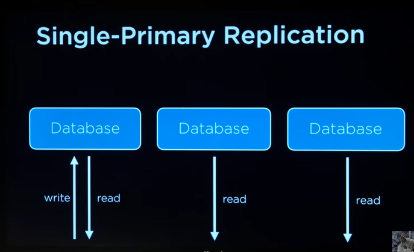
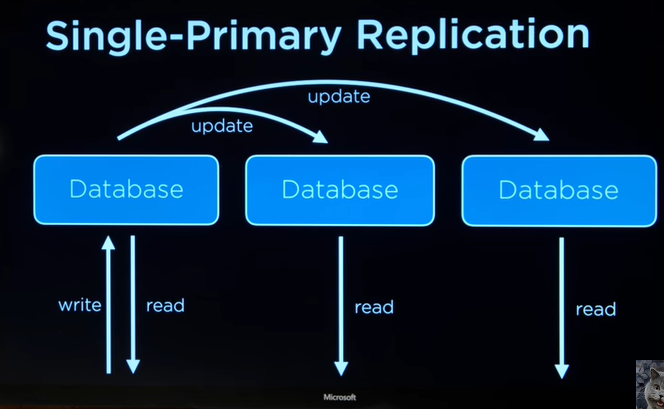
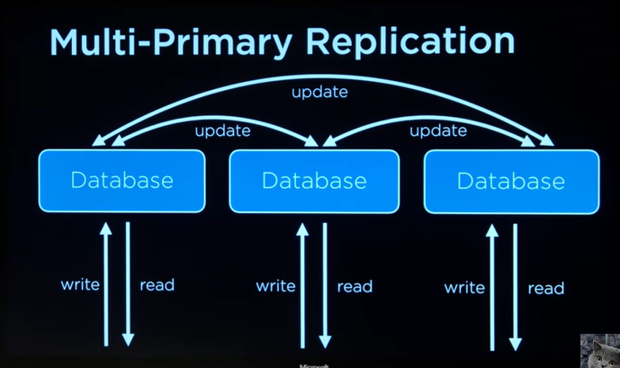

## Servers:

- Cloud
- On-Premise

## Vertical Scaling

## Horizontal Scaling

## Load Balancer

### Load Balancing Methods

- Random Choice
- Round Robin
- Fewest Connection

### Session-Aware Load Balancing

- Sticky Session
- Sessions in Database
- Client-side session
- ...

### heart beat process

- check latency

## Database Scaling

- vertical partitioning
- horizontal partitioning

### Database Replication

- Single-primary Replication
  
  

- Multi-primary Replication
  

## Caching

- Client-side caching
- Django Caching framework
  > Per view caching
  > django fragment caching
  > low-level caching API
